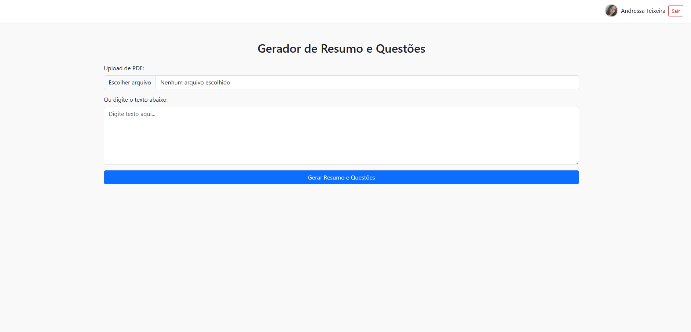

# Projeto final: Aplicação com login federado e API para serviço de IA

Acesso: https://project4-2025a-andressa.vercel.app/

### Desenvolvedora
Andressa Teixeira

### Nosso produto

Gerador de Resumos e Questões de multipla escolha.

### Desenvolvimento

#### Tecnologias
- HTML
- CSS
- React/Vite
- Node.js
- Supabase
- IA: Meta-Llama-3-8B-Instruct

#### Ambiente de desenvolvimento
- VS Code
- Supabase
- Vercel
- Render

#### Referências e créditos

Substitua este trecho por uma lista bem detalhada de todo material consultado para ajudar no projeto, por exemplo:  URL de templates usados, URL de icon kits usados, créditos para colegas que colaboraram, geradores de código (incluindo alguns prompts usados para o ChatGPT, se for o caso)
- https://developers.google.com/identity/sign-in/web/sign-in?hl=pt-br
- https://cloud.google.com/identity-platform/docs/web/google?hl=pt-br
- https://huggingface.co/google/flan-t5-base
- https://huggingface.co/meta-llama/Meta-Llama-3-8B-Instruct

---
Projeto entregue para a disciplina de [Desenvolvimento de Software para a Web](http://github.com/andreainfufsm/elc1090-2025a) em 2025a